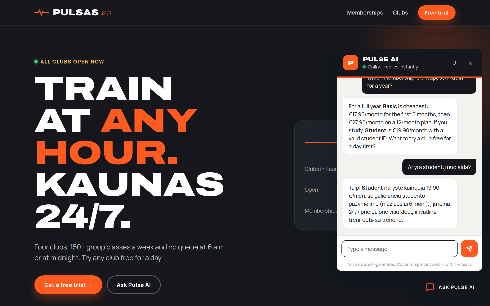
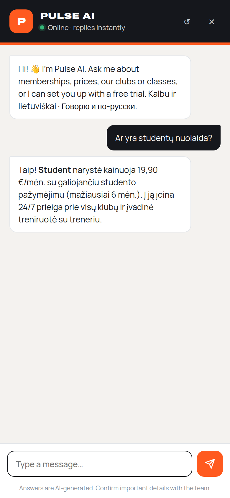
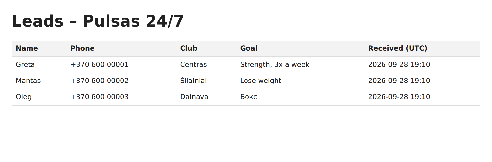
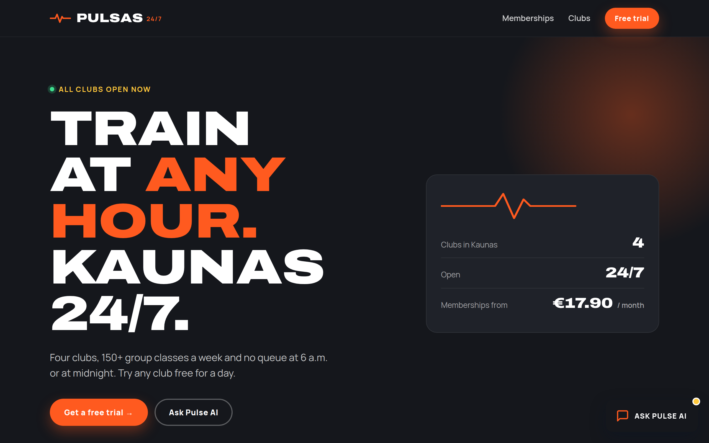
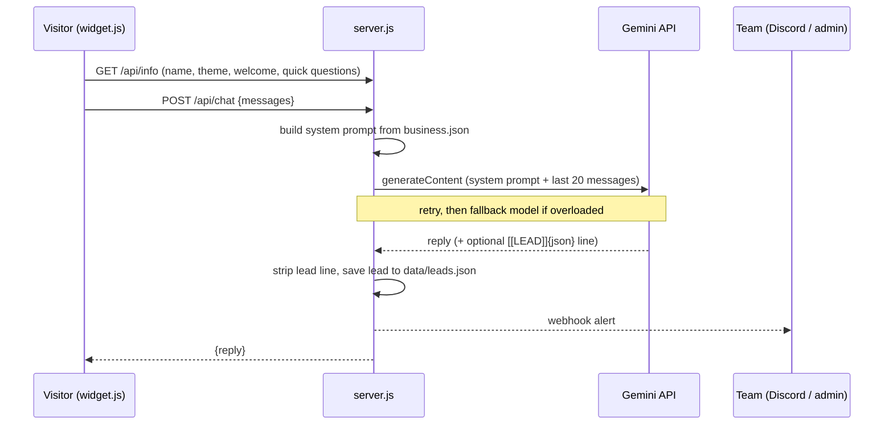

# AI Website Assistant

An embeddable AI chat assistant for small-business websites. It answers visitors 24/7 **only from the business's own information**, replies in the visitor's language, and turns interested visitors into **leads** that go straight to the team.

One `<script>` tag adds it to any site. The backend is a single Node.js file with **zero npm dependencies**.

### 🔴 [Live demo → ai-website-assistant-k9c7.onrender.com](https://ai-website-assistant-k9c7.onrender.com/)

Open it and click **Ask Pulse AI**. Try English, Lithuanian or Russian, or ask for a free trial. The first visit can take up to a minute while the free server wakes up.

> The demo business, **Pulsas 24/7**, is a fictional gym chain in Kaunas. Prices and clubs are made up.



---

## Features

- **Grounded answers.** The model gets the business facts from `business.json` and strict rules. If something isn't there (e.g. parking), it says so and points to the phone number instead of making things up.
- **Any language.** Default language is configurable. It automatically switches to Lithuanian, Russian, English, etc. when the visitor does.
- **Lead capture.** Collects name, phone, club and goal in a natural conversation, confirms the details, then saves the lead, pings a Discord webhook and lists it on a password-protected admin page.
- **Drop-in widget.** Shadow DOM, so the host site's CSS can't break it (and vice versa). Themeable colours, fonts and radius; mobile full-screen mode; keyboard accessible; reduced-motion aware.
- **Host page API.** `window.bizAssistant.open()` and `window.bizAssistant.ask("…")` let any button on the page start a conversation.
- **Reusable for any business.** Swap `business.json` to turn it into a café, salon or car-service assistant (see `examples/cafe.json`).
- **Resilient.** If Gemini is overloaded or rate-limited, the server retries and falls back to a lighter model, so visitors get an answer instead of an error.
- **Safe defaults.** API key stays server-side, per-IP rate limiting, request size and history limits, CORS allow-list, path-traversal-safe static serving, HTML-escaped admin output.

| Mobile | Owner's lead list |
|---|---|
|  |  |

Full demo site:



---

## How it works



The lead hand-off is a small text protocol. After the visitor confirms their details, the model ends its reply with one line `[[LEAD]]{"name":…,"phone":…}`. The server removes that line before the visitor sees the reply, parses it, and stores the lead. If the JSON is malformed, nothing is saved and the marker never leaks to the visitor. This path is covered by tests.

## Project structure

```
server.js            HTTP server: chat proxy, prompt builder, leads, admin page, static files
business.json        everything business-specific: facts, rules, theme, texts, lead fields
public/widget.js     the embeddable chat widget (vanilla JS, Shadow DOM)
public/index.html    demo website for the fictional gym
examples/cafe.json   the same engine configured for a café (table bookings)
tests/               node:test suite with a fake Gemini server
docs/                screenshots
```

## Quick start

Requires **Node.js 18+** and a free Gemini API key from [Google AI Studio](https://aistudio.google.com/apikey).

```bash
git clone https://github.com/Tadas380/ai-website-assistant.git
cd ai-website-assistant
cp .env.example .env        # then paste your key into GEMINI_API_KEY
npm start                   # http://localhost:3000
```

No `npm install` is needed.

| Variable | Purpose |
|---|---|
| `GEMINI_API_KEY` | required |
| `GEMINI_MODEL` | default `gemini-flash-latest` |
| `GEMINI_FALLBACK_MODELS` | comma-separated, used when the main model is busy (default `gemini-flash-lite-latest`) |
| `ADMIN_KEY` | password for `/admin?key=…` |
| `DISCORD_WEBHOOK_URL` | optional lead alerts |
| `ALLOWED_ORIGINS` | sites allowed to embed the widget (`*` for any) |

## Use it for another business

Edit `business.json`:

| Field | What it controls |
|---|---|
| `name`, `assistantName`, `icon`, `buttonLabel` | branding |
| `theme` | colours, radius, fonts |
| `defaultLanguage` | reply language unless the visitor writes in another one |
| `welcome`, `chips`, `ui` | greeting, quick-question buttons, UI texts |
| `info` | the facts: prices, locations, hours, services (any JSON shape) |
| `rules` | extra behaviour rules |
| `lead` | which fields to collect, alert title, labels |

Try the café version: `cp examples/cafe.json business.json`.

## Embed on any website

```html
<script src="https://your-deployment.example/widget.js" defer></script>
```

This works on plain HTML, WordPress, Wix, Shopify and similar platforms. Set `ALLOWED_ORIGINS=https://client-site.lt` in production.

## API

| Method | Path | Description |
|---|---|---|
| `GET` | `/api/info` | public widget settings (no business facts or rules) |
| `POST` | `/api/chat` | `{ messages: [{ role: "user" \| "assistant", text }] }` → `{ reply, leadSaved }` |
| `GET` | `/admin?key=…` | lead list for the business owner |

## Tests

```bash
npm test
```

There are 15 tests using Node's built-in test runner. They cover the lead parser, the prompt builder, rate limiting, model retry and fallback, and the HTTP endpoints against a fake Gemini server, so no API key or network is needed.

## Deploy

Any Node host works. On **Render** (free tier), create a Web Service with start command `node server.js` and set the environment variables above. On the free tier the disk isn't persistent, so treat webhook alerts as the durable record, or add a database.

## Limitations and next steps

- Leads are stored in a JSON file. The next step is SQLite/Postgres plus email notifications.
- Responses aren't streamed yet. Server-sent events would show the answer as it's written.
- An analytics view of the most-asked questions would show businesses what customers want.

## Author

**Tadas Kaziunas**, Kaunas, Lithuania · [github.com/Tadas380](https://github.com/Tadas380)

MIT licensed. See [LICENSE](LICENSE).
